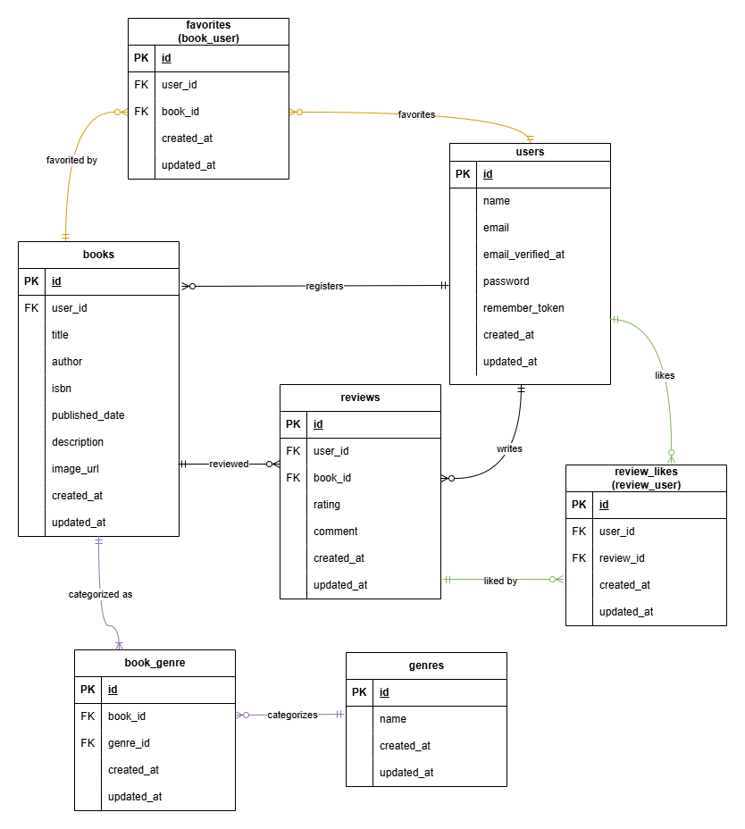

# プロジェクト名：COACHTECH 書籍レビューアプリ BookShelf

## 概要

### プロジェクトの目的

模擬案件を通して、実務を想定したWebアプリケーション開発と、曖昧な要件から自ら仕様を設計しPMと詳細を詰めるプロセスを経験すること。

### 実装した機能の概要説明

ユーザーが書籍を登録し、レビュー・お気に入り・いいねを通じて書籍の評価を共有できるWebアプリケーション

- 一般機能：
    1. ユーザー認証（登録・ログイン・ログアウト）※Fortify
    2. ジャンル管理（一覧・登録・編集・削除）
    3. 書籍管理（一覧・詳細・登録・編集・削除）
    4. レビュー機能（投稿・編集・削除）
    5. お気に入り機能（登録・解除）
    6. いいね機能（レビューへのいいね）
    7. ランキング機能（書籍の評価ランキング表示）
    8. 公開API（書籍情報の取得）

## ER図



## 環境構築手順

### 1. リポジトリのクローン

以下のコマンドでリポジトリをクローンします。

```
git clone https://github.com/shiho5shiho/Bookshelf

cd Bookshelf
```

### 2. .envファイルの作成

以下のコマンドを実行し、`.env` ファイルを作成します。

```
cp .env.example .env
```

作成後、`.env` ファイルを開き、データベース接続情報を以下と一致させてください。

    DB_CONNECTION=mysql
    DB_HOST=mysql
    DB_PORT=3306
    DB_DATABASE=laravel
    DB_USERNAME=sail
    DB_PASSWORD=password

### 3. パッケージインストール

```
composer install
```

### 4. Sailの起動とエイリアス設定

Sailをバックグラウンドで起動します。

```
./vendor/bin/sail up -d
```

> 以降のコマンドを `sail` のみで実行できるよう、エイリアスを設定します。（任意）

```
echo "alias sail='[ -f sail ] && bash sail || bash vendor/bin/sail'" >> ~/.zshrc
```

> ターミナルを再起動し、エイリアスを有効化します。

```
exec $SHELL
```

※エイリアスを設定しない場合は、以降の `sail` を `./vendor/bin/sail` に置き換えて実行してください。

### 5. フロントエンド依存パッケージのインストール

Sailコンテナが起動していることを確認し、sail npm install を実行します。

```
sail npm install
```

### 6. Alpine.jsのインストール

ルートディレクトリで以下のコマンドを実行します。

```
sail npm install alpinejs
```

### 7. アプリケーションキーの生成

ルートディレクトリで以下のコマンドを実行し、アプリケーションキーを生成します。

```
sail artisan key:generate
```

### 8. データベースのマイグレーションと初期データ投入

以下のコマンドでテーブルを作成し、初期データを投入してください。

```
sail artisan migrate --seed
```

※データベースを初期化したい場合のみ、以下を実行してください。

```
sail artisan migrate:fresh --seed
```

### 9. Vite開発サーバーの起動

```
sail npm run dev
```

※ `sail npm run dev` はアプリケーション確認中は実行したままにしてください。

## 使用技術

- PHP 8.2
- Laravel 10.x
- MySQL 8.4
- Nginx
- Docker / Laravel Sail
- Tailwind CSS 3.4
- Alpine.js
- Vite
- phpMyAdmin

## エラーページの日本語化

Laravel標準のエラーページを日本語で表示します。`config/app.php` の `locale` を `ja` に設定し、`lang/ja.json` に各HTTPステータスの文言を一括定義しています。<br>
※`laravel-lang/*` パッケージは使用せず、翻訳ファイルは手動で管理

| ステータスコード | 翻訳キー（英語）      | 表示文言（日本語）                                                   |
| :--------------: | :-------------------- | :------------------------------------------------------------------- |
|       401        | `Unauthorized`        | 認証が必要です                                                       |
|       402        | `Payment Required`    | お支払いが必要です                                                   |
|       403        | `Forbidden`           | アクセスが拒否されました                                             |
|       404        | `Not Found`           | ページが見つかりません                                               |
|       419        | `Page Expired`        | ページの有効期限が切れました。お手数ですが、もう一度お試しください。 |
|       429        | `Too Many Requests`   | リクエストが多すぎます。しばらく時間をおいてから再度お試しください。 |
|       500        | `Server Error`        | サーバーエラーが発生しました。時間をおいて再度お試しください。       |
|       503        | `Service Unavailable` | 現在メンテナンス中です。しばらくお待ちください。                     |

## APIエンドポイント一覧

## APIエンドポイント一覧

ベースURL: `http://localhost/api/v1`

| メソッド | パス            | 概要                                                                                                               |
| -------- | --------------- | ------------------------------------------------------------------------------------------------------------------ |
| GET      | `/books`        | 書籍一覧。キーワード検索・ジャンル絞り込み・ページネーションに対応。各書籍にジャンル・平均評価・レビュー件数を含む |
| GET      | `/books/{book}` | 書籍詳細。ジャンルとレビュー（投稿者名・評価・コメント・投稿日時）を含む                                           |
| POST     | `/books`        | 書籍登録。バリデーションエラーは日本語メッセージを返す                                                             |
| PUT      | `/books/{book}` | 書籍更新。ISBNの一意性チェックは自身を除外                                                                         |
| DELETE   | `/books/{book}` | 書籍削除。関連するレビュー・お気に入り・ジャンル紐付けも削除                                                       |

- 成功時: `200`（取得・更新） / `201`（登録） / `204`（削除）
- エラー時: `404`（存在しないID） / `422`（バリデーションエラー）
           |
## 開発環境URL

- アプリケーション: <http://localhost>
- phpMyAdmin: <http://localhost:8080>

## 作成者

奥出 詩穂
