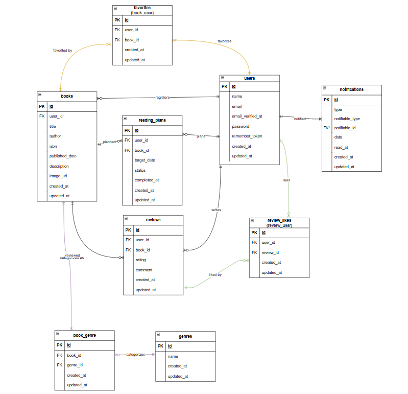

# プロジェクト名：COACHTECH 書籍レビューアプリ BookShelf

## 概要

### プロジェクトの目的

模擬案件を通して、実務を想定したWebアプリケーション開発と、曖昧な要件から自ら仕様を設計しPMと詳細を詰めるプロセスを経験すること。

### 実装した機能の概要説明

ユーザーが書籍を登録し、レビュー・お気に入り・いいねを通じて書籍の評価を共有できるWebアプリケーション

- 一般機能：
    1. ユーザー認証（登録・ログイン・ログアウト）※Fortify
    2. ジャンル管理（一覧・登録・編集・削除）
    3. 書籍管理（一覧・詳細・登録・編集・削除）
    4. レビュー機能（投稿・編集・削除）
    5. お気に入り機能（登録・解除）
    6. いいね機能（レビューへのいいね）
    7. ランキング機能（書籍の評価ランキング表示）
    8. 公開API（書籍情報の取得）

- 応用機能：
    1. 検索・絞り込み・並び替え（キーワード／ジャンル／並び順）
    2. 通知機能
    3. 読書計画（登録・進捗管理）
    4. マイ読書レポート
    5. 日次バッチ処理（読書計画の自動失効・リマインダー送信）
    6. ISBN検索（Google Books API連携）
    7. Sanctum認証（書き込み系APIのトークン必須化）

## ER図



## プロジェクト環境構築手順

### 1. リポジトリのクローン

以下のコマンドでリポジトリをクローンします。

```
git clone https://github.com/shiho5shiho/Bookshelf

cd Bookshelf
```

### 2. .envファイルの作成

以下のコマンドを実行し、`.env` ファイルを作成します。

```
cp .env.example .env
```

作成後、`.env` ファイルを開き、データベース接続情報を以下と一致させてください。

    DB_CONNECTION=mysql
    DB_HOST=mysql
    DB_PORT=3306
    DB_DATABASE=laravel
    DB_USERNAME=sail
    DB_PASSWORD=password

### 3. パッケージインストール

```
composer install
```

### 4. Sailの起動とエイリアス設定

Sailをバックグラウンドで起動します。

```
./vendor/bin/sail up -d
```
※ M1/M2/M3 Mac（Apple Silicon）をお使いの方：  
`sail up -d` 実行時に no matching manifest for linux/arm64/v8 エラーが発生した場合、`compose.yaml` の mysql サービスに `platform: 'linux/amd64'` を追加してください。

> 以降のコマンドを `sail` のみで実行できるよう、エイリアスを設定します。（任意）

```
echo "alias sail='[ -f sail ] && bash sail || bash vendor/bin/sail'" >> ~/.zshrc
```

> ターミナルを再起動し、エイリアスを有効化します。

```
exec $SHELL
```

※エイリアスを設定しない場合は、以降の `sail` を `./vendor/bin/sail` に置き換えて実行してください。

### 5. フロントエンド依存パッケージのインストール

Sailコンテナが起動していることを確認し、sail npm install を実行します。

```
sail npm install
```

### 6. Alpine.jsのインストール

ルートディレクトリで以下のコマンドを実行します。

```
sail npm install alpinejs
```

### 7. アプリケーションキーの生成

ルートディレクトリで以下のコマンドを実行し、アプリケーションキーを生成します。

```
sail artisan key:generate
```

### 8. データベースのマイグレーションと初期データ投入

以下のコマンドでテーブルを作成し、初期データを投入してください。

```
sail artisan migrate --seed
```

※データベースを初期化したい場合のみ、以下を実行してください。

```
sail artisan migrate:fresh --seed
```

### 9. Vite開発サーバーの起動

```
sail npm run dev
```

※ `sail npm run dev` はアプリケーション確認中は実行したままにしてください。

### ログイン情報（動作確認用）

`sail artisan migrate --seed` 実行後、以下のユーザーでログインできます（パスワードは全員共通で `password`）。

| 名前     | メールアドレス        | パスワード |
| -------- | --------------------- | ---------- |
| 山田太郎 | yamada@example.com    | password   |
| 鈴木花子 | suzuki@example.com    | password   |
| 田中一郎 | tanaka@example.com    | password   |
| 佐藤美咲 | sato@example.com      | password   |
| 高橋健太 | takahashi@example.com | password   |

※読書計画などの動作確認シナリオは、山田太郎（yamada@example.com）に集約して投入されています。


## 使用技術

- PHP 8.2
- Laravel 10.x
   - Laravel Sanctum（API認証）
   - Laravel Pint（コードスタイル）
- PHPStan(Larastan)（静的解析）
- MySQL 8.4
- Nginx
- Docker / Laravel Sail
- Tailwind CSS 3.4
- Alpine.js
- Vite
- phpMyAdmin

## エラーページの日本語化

`config/app.php` の `locale` を `ja` に設定した上で、エラーの種類によって日本語化の方法を分けています。

- **バリデーション・認証エラー（Web画面）**：`lang/ja/` ディレクトリ配下の `auth.php`・`validation.php`・`passwords.php` に文言を定義
- **APIやシステムエラー（401・403・404など）**：`app/Exceptions/Handler.php` の `render()` メソッドをオーバーライドし、個別に日本語メッセージとJSONレスポンスを返却

|                   ステータスコード                   | 対象                                                                                                | 表示・返却例                                        |
| :--------------------------------------------------: | :-------------------------------------------------------------------------------------------------- | :-------------------------------------------------- |
|                         401                          | 未認証（API）                                                                                       | `{"error": "認証が必要です。"}`                     |
|                         403                          | 認可エラー（API）                                                                                   | `{"error": "この操作を行う権限がありません。"}`     |
|                         404                          | 存在しないID（API）                                                                                 | `{"error": "書籍が見つかりませんでした。"}`         |
|                         422                          | バリデーションエラー                                                                                | Laravel標準の `{"message": "...", "errors": {...}}` |
| Web側のエラー画面（401/403/404/419/429/500/503など） | Laravel標準機能にお任せ（`config/app.php`の`locale`設定により自動で日本語エラーページが表示される） | ー                                                  |


※`laravel-lang/*` パッケージは使用せず、翻訳ファイルは手動で管理

## 日次バッチ処理（応用）

読書計画の自動失効・リマインダー送信は、以下のArtisanコマンドで実行されます。本番環境ではLaravelのスケジューラにより毎日0:00に自動実行されますが（`app/Console/Kernel.php`にて`daily()`で設定）、動作確認のために手動実行も可能です。

```bash
# 期限切れの読書計画を自動的に失効させる
sail artisan reading-plans:expire

# 読書計画のリマインダー通知を送信する
sail artisan reading-plans:send-reminders
```

## APIエンドポイント一覧

ベースURL: `http://localhost/api/v1`

| メソッド | パス            | 認証                               | 概要                                                                                                                                 |
| -------- | --------------- | ---------------------------------- | ------------------------------------------------------------------------------------------------------------------------------------ |
| GET      | `/books`        | 不要                               | 書籍一覧。キーワード検索・ジャンル絞り込み・ページネーションに対応。各書籍にジャンル・平均評価・レビュー件数を含む                   |
| GET      | `/books/{book}` | 不要                               | 書籍詳細。ジャンルとレビュー（投稿者名・評価・コメント・投稿日時）を含む                                                             |
| POST     | `/books`        | 必須（Bearerトークン）             | 書籍登録。登録者は認証済みユーザーから自動的に決まる（リクエストボディでの指定は不可）。バリデーションエラーは日本語メッセージを返す |
| PUT      | `/books/{book}` | 必須（Bearerトークン・所有者のみ） | 書籍更新。ISBNの一意性チェックは自身を除外                                                                                           |
| DELETE   | `/books/{book}` | 必須（Bearerトークン・所有者のみ） | 書籍削除。関連するレビュー・お気に入り・ジャンル紐付けも削除                                                                         |

- 成功時: `200`（取得・更新） / `201`（登録） / `204`（削除）
- エラー時: `401`（未認証） / `403`（他人の書籍への操作など権限なし） / `404`（存在しないID） / `422`（バリデーションエラー）
- エラーレスポンスの形式: 401・403・404は `{"error": "メッセージ"}`、422はLaravel標準の `{"message": "...", "errors": {...}}`
- 認証方式: [Laravel Sanctum](https://laravel.com/docs/10.x/sanctum) のBearerトークン認証。書き込み系（POST/PUT/DELETE）のみ認証必須。GET系は誰でも利用可能
- 動作確認用トークンの発行例（`sail artisan tinker` 上で実行）:

```php
  $user = \App\Models\User::first();
  $user->createToken('manual-test')->plainTextToken;
```

  発行した文字列を `Authorization: Bearer <トークン>` ヘッダーに載せてリクエストする

## テスト
### テストコードの構成

本プロジェクトのテストは、目的に応じて以下のディレクトリに分かれています。

| ディレクトリ            | 内容                                                                             |
| :---------------------- | :------------------------------------------------------------------------------- |
| `tests/Unit`            | クラス単体のロジックを検証するテスト。                                           |
| `tests/Feature`         | 画面(Web)経由の一連の操作フローを検証するテスト。                                |
| `tests/Feature/Api`     | 公開APIのリクエスト・レスポンスを検証するテスト。                                |
| `tests/Feature/Console` | コンソールコマンドのスケジュール登録など、フレームワークの設定を検証するテスト。 |

なお、基本フェーズはテストをまとめて実装しましたが、応用フェーズでは各機能のテストを対応するIssueのPR内に含める形で進めています。

各テストメソッドは日本語の命名(例:`test_書籍を登録できる`)で、何を検証しているかが分かるようにしています。また、処理の見通しを良くするため、基本的にArrange(準備)・Act(実行)・Assert(検証)の3ブロックに分けてコメントを記述しています。

なお、認証が絡むテストでは、Sanctumが提供する`Sanctum::actingAs()`というテスト専用のヘルパーを使い、実際のトークン発行を省略して「認証済みユーザーとして操作する」状態を再現しています。一部のテストでは、実際にトークンを発行して`Authorization`ヘッダーに付与する方式でも認証を確認しています。

### テストの実行方法
本番用のMySQLとは分離し、SQLiteのインメモリDB（`:memory:`）でテストを実行します（`phpunit.xml`に設定済みのため、追加の作業は不要です）。  
ディスクI/Oが発生しないため実行が高速なうえ、`RefreshDatabase`トレイトによりテストごとに空の状態から始まるため、開発用DBのデータを一切汚しません。  
カバレッジ計測用の`XDEBUG_MODE=coverage`、Google Books API連携用の設定も`.env.example`にあらかじめ含まれているため、追加の入力は不要です。

```bash
# 全テストを実行する
sail artisan test

# 特定のテストクラス・メソッドのみ実行する
sail artisan test --filter=BookApiTest

# コードスタイルチェック(Laravel Pint)
sail bin pint --test

# 静的解析(PHPStan / Larastan)
sail bin phpstan analyse

# カバレッジの概要をターミナルに出力する
sail artisan test --coverage
```

> プロジェクト全体で98.1%のカバレッジを達成しています（要件基準：基本機能60%以上／応用機能を含めて80%以上）。
※`TrustHosts`ミドルウェアや`BroadcastServiceProvider`など、本プロジェクトの要件上使用していない一部のLaravel標準機能については、実行経路自体が存在しないためカバレッジが0%となっていますが、実装済みロジックの検証漏れではありません。

## 開発環境URL

- アプリケーション: <http://localhost>
- phpMyAdmin: <http://localhost:8080>

## 作成者

奥出 詩穂
